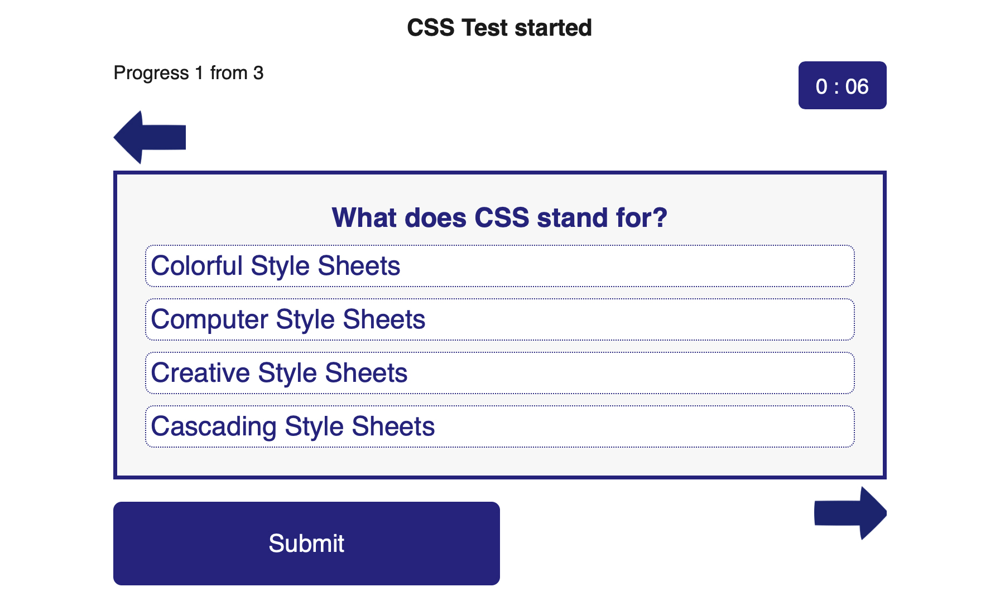
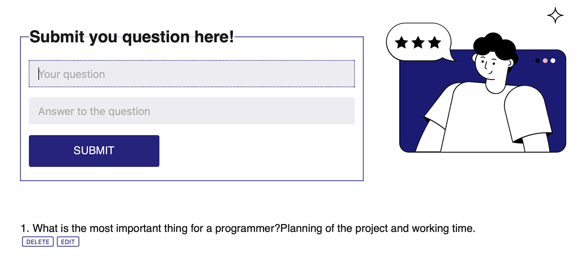

## Junior? You can test your knowledge here!

This project is a quiz test Application for testing knowledge on the most important topics for beginner front-end developers.

### Scrinshorts from Application

In the project directory, you can run:

### Used languages and tools
* React
    * LocalStorage
    * CRUD
    * Hooks
    * Router
* JavaScript
    * SetInterval
* CSS
* HTML
<!-- _The page will reload when you make changes._\
__You may also see any lint errors in the console.__
### `npm test`
1111|2222|3333
:---|:--:|:---: -->
